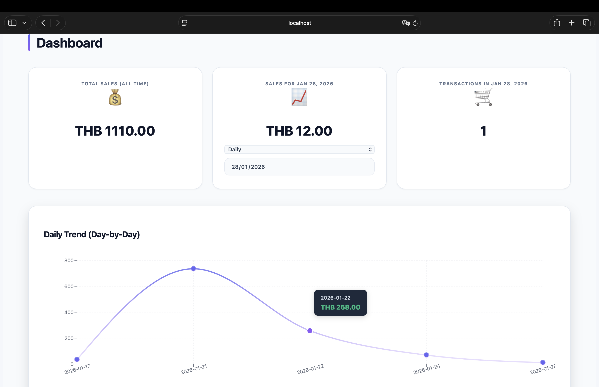
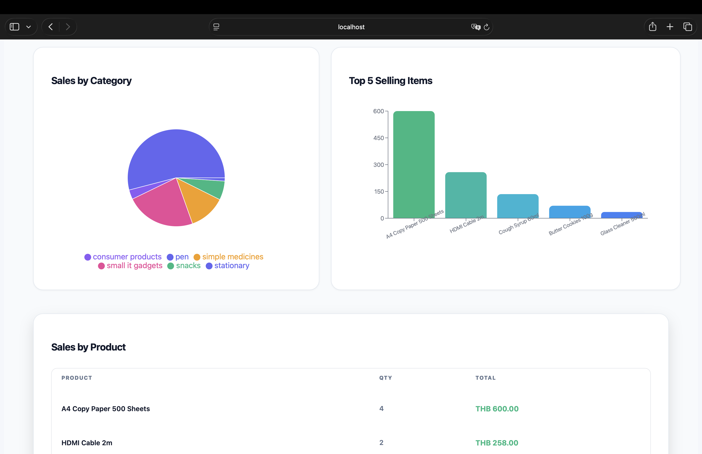
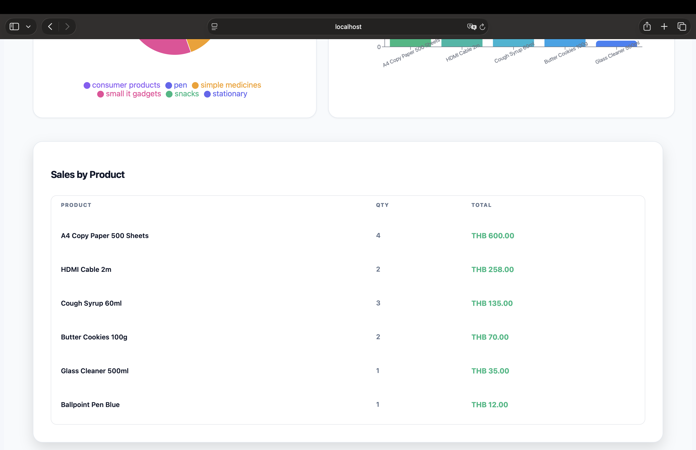
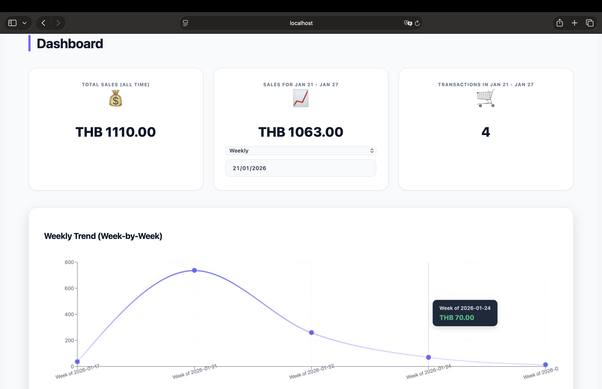
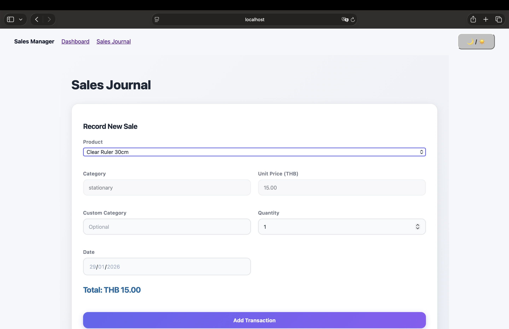
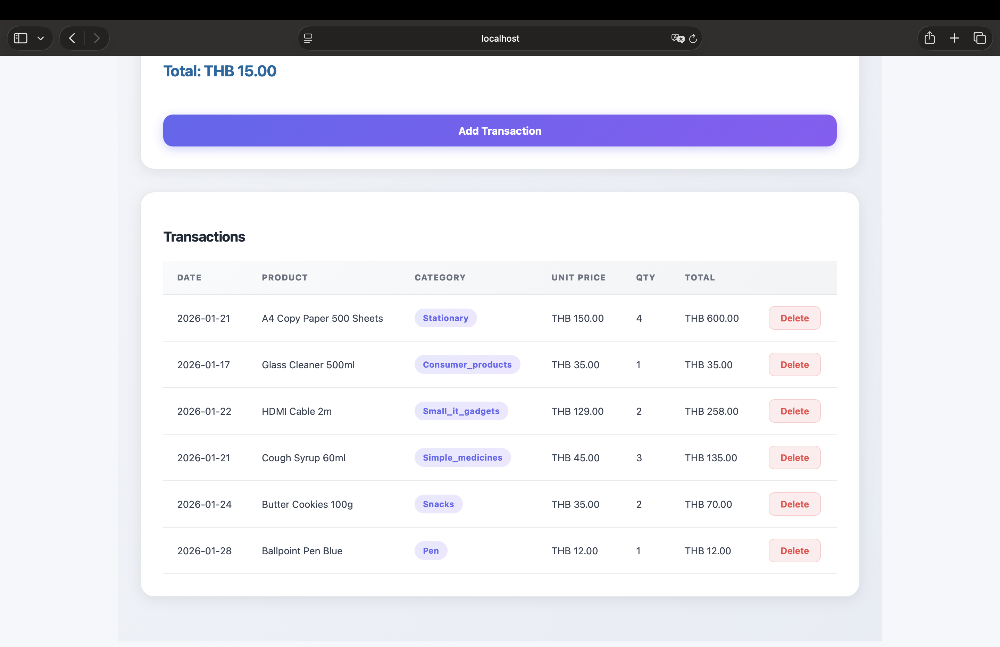

# Sales Manager

A modern sales management dashboard built with React, featuring real-time analytics, interactive charts, and data visualization.

## Live Demo

**GitHub Pages:** [https://shunelw.github.io/sales-manager/](https://shunelw.github.io/sales-manager/)

## Team Members

- Member 1 Shune Lai Wai
- Member 2 Yoon Hsu Hlaing
- Member 3 Nyi Phyo Kyaw

## Features

- **Sales Transaction Recording** - Add sales with product selection, quantity, and custom categories
- **Real-time Dashboard** - View sales metrics and analytics instantly
- **Interactive Charts**
  - Line Chart - Daily/Weekly/Monthly sales trends
  - Pie Chart - Sales distribution by category
  - Bar Chart - Top 5 best-selling items
- **Sales Summary** - Filter by day, week, or month with date pickers
- **Product Management** - 50+ products across 5 categories
- **Custom Categories** - Add custom spending categories
- **Dark Mode** - Toggle between light and dark themes
- **Data Persistence** - All data saved in localStorage
- **Responsive Design** - Works on desktop, tablet, and mobile

## Screenshots

### Dashboard 






### Sales Journal



## Technologies Used

- Frontend: React 18
- Build Tool: Vite
- Styling: CSS
- Charts: Chart.js/ Recharts

## Installation & Setup

### Prerequisites
- Node.js 18+ 
- pnpm (or npm)

### Steps

1. **Clone the repository**
```bash
git clone https://github.com/Shunelw/sales-manager.git
cd sales-manager
```

2. **Install dependencies**
```bash
pnpm install
```

3. **Start development server**
```bash
pnpm dev
```

4. **Open in browser**
```
http://localhost:5173
```

## Deployment

This project is deployed on GitHub Pages.

**Build for production:**
```bash
pnpm build
```

**Deploy to GitHub Pages:**
```bash
pnpm deploy
```

## Project Structure
```
sales-manager/
├── src/
│   ├── components/        
│   │   ├── Navbar.jsx
│   │   ├── ThemeToggle.jsx
│   │   ├── SalesForm.jsx
│   │   ├── TransactionsTable.jsx
│   │   ├── MetricCard.jsx
│   │   ├── SalesTrendChart.jsx
│   │   ├── SalesByCategoryPie.jsx
│   │   ├── TopSellingProducts.jsx
│   │   └── SalesByProduct.jsx
│   ├── pages/             
│   │   ├── Dashboard.jsx
│   │   └── SalesJournal.jsx
│   ├── styles/            
│   │   ├── dashboard.css
│   │   ├── sales.css
│   │   └── theme.css
│   ├── utils/             
│   │   ├── storage.js
│   │   └── salesUtils.js
│   ├── data/              
│   │   └── products.json
│   ├── App.jsx            
│   └── main.jsx           
├── public/                
├── index.html             
├── vite.config.js        
└── package.json           
```

## How to Use

### Adding a Sale
1. Navigate to **Sales Journal** page
2. Select a product from the dropdown
3. Enter quantity and date
4. (Optional) Add a custom category
5. Click **Add Transaction**

### Viewing Analytics
1. Go to **Dashboard** page
2. Select time period (Daily/Weekly/Monthly)
3. Pick a specific date/week/month using the date picker
4. View sales metrics, charts, and top products

### Dark Mode
Click the 🌙/☀️ button in the navigation bar to toggle themes.

## Features in Detail

### Sales Summary Cards
- **Total Sales (All Time)** - Lifetime revenue
- **Sales for Selected Period** - Filtered by day/week/month
- **Transactions Count** - Number of sales in period

### Charts
- **Line Chart** - Visualize sales trends over time
- **Pie Chart** - Category distribution (all-time)
- **Bar Chart** - Top 5 products by revenue (all-time)
- **Product Table** - Complete product sales breakdown (all-time)


## License

This project is created for educational purposes as part of CSX4107 Web Application course.


